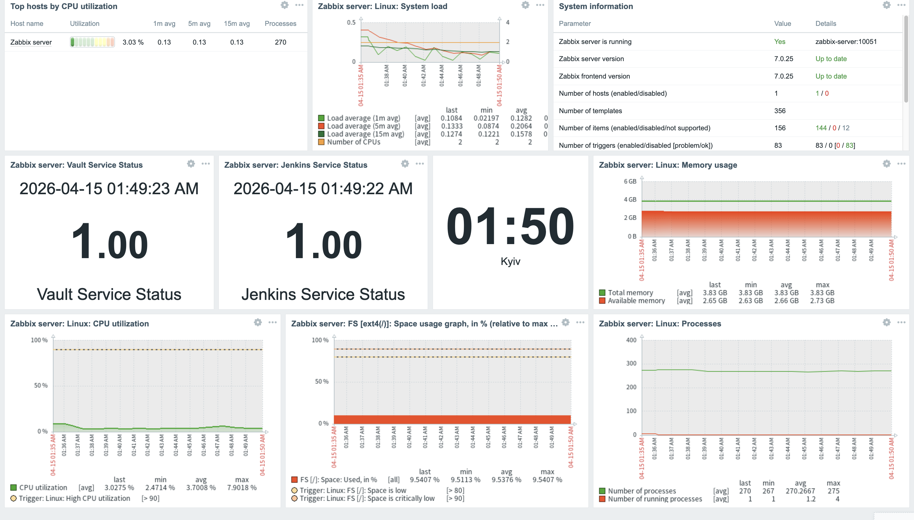
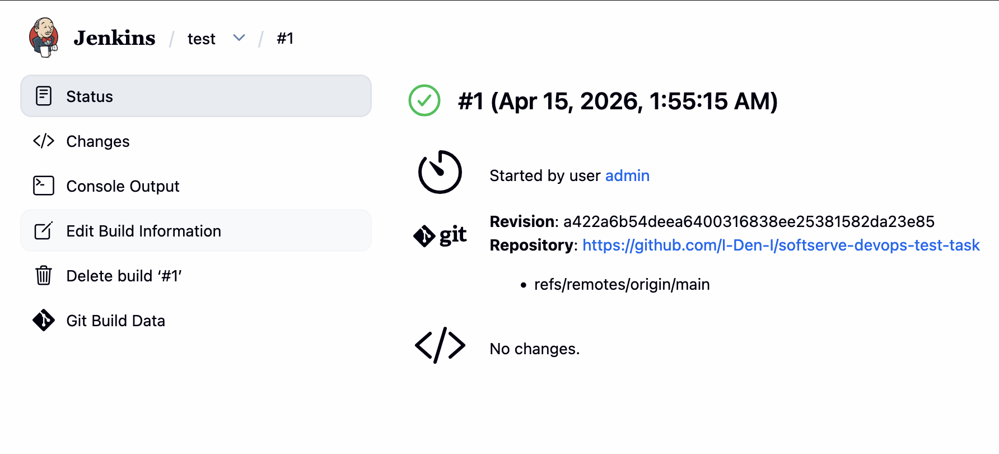
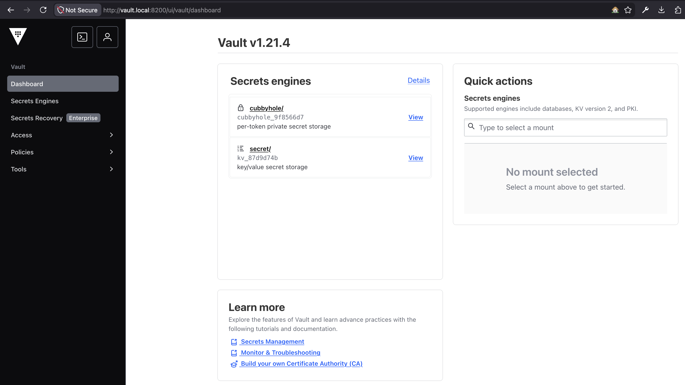

# 🚀 DevOps Infrastructure Automation Task

This project provides a fully automated, multi-architecture environment featuring **Jenkins**, **Zabbix**, and **HashiCorp Vault**. [cite_start]The entire stack is deployed on a single **Debian 12** VM using **Vagrant**, **Docker**, and **Ansible** with a focus on "Zero Manual Configuration"[cite: 4, 8, 9, 12].

---

## 🏗 Architecture Overview

The infrastructure is built on a virtual machine that serves as a host for the following services:

* [cite_start]**Nginx Reverse Proxy**: Acts as a single entry point (Port 80), routing traffic to services based on domain names[cite: 55, 58, 60].
* [cite_start]**Jenkins (LTS)**: Automated CI/CD server with pre-installed Git plugins and an auto-created Admin user[cite: 7, 25, 29].
* [cite_start]**Zabbix 7.0**: Containerized monitoring solution with automated PostgreSQL database initialization[cite: 5, 16, 31, 59].
* [cite_start]**HashiCorp Vault**: Secure secret management service, pre-initialized and unsealed[cite: 6, 17, 20, 22].

---

## 📋 Prerequisites

### 1. Hardware & OS
* [cite_start]**Architecture**: Supported on both **ARM64** (Apple Silicon) and **x86_64** (Intel/AMD)[cite: 12].
* **RAM**: Minimum **8 GB** (4 GB is allocated to the VM).
* **Virtualization**: Must be enabled in BIOS/UEFI.

### 2. Software Stack
* **Vagrant**: Version **2.3.0** or higher[cite: 11].
* **Hypervisor**: 
    * **macOS (ARM)**: VMware Desktop (Free for personal use).
    * **Windows (x64)**: Oracle VirtualBox 7.0+.

---

## ⚙️ 3. Automatic Network Configuration

[cite_start]To access services via domain names without manual editing, use the provided automation scripts[cite: 55]. [cite_start]These scripts map the VM IP to your host's `hosts` file[cite: 56, 57, 58].

* **Windows**: Right-click **`setup_hosts.bat`** and select **Run as Administrator**.
* **macOS / Linux**: Run `chmod +x setup_hosts.sh && sudo ./setup_hosts.sh`.

---

## 🚀 4. Quick Start

1.  Clone this repository[cite: 44].
2.  Run the network setup script (see step 3).
3.  Deploy the infrastructure:
    ```bash
    vagrant up
    ```
    *All services will be fully operational after this command with no manual steps required[cite: 9].*

---

## 🌐 Service Access

| Service | URL | Credentials (Login/Pass) |
| :--- | :--- | :--- |
| **Jenkins** | [http://jenkins.local](http://jenkins.local) | `admin` / `admin` [cite: 26] |
| **Zabbix** | [http://zabbix.local](http://zabbix.local) | `Admin` / `zabbix` [cite: 31] |
| **Vault** | [http://vault.local:8200](http://vault.local:8200) | Root Token: `root` [cite: 21] |

---

## 📖 Usage Examples (Step-by-Step)

### **How to write a secret in Vault** [cite: 51]
1.  [cite_start]Log in to the Vault UI at [http://vault.local:8200](http://vault.local:8200) using the `root` token[cite: 23].
2.  Navigate to **Secrets Engines** and select the `secret/` path.
3.  Click **Create secret**, enter a path (e.g., `my-app/config`).
4.  Add a Key/Value pair (e.g., `api_key` = `secret123`) and click **Save**.

### **How to create a job in Jenkins** [cite: 52]
1.  Log in to Jenkins at [http://jenkins.local](http://jenkins.local).
2.  Click **New Item**, enter `my-first-job`, and select **Freestyle project**[cite: 28].
3.  In the **Source Code Management** section, select **Git**[cite: 29].
4.  Provide a GitHub repository URL (e.g., `https://github.com/octocat/Hello-World.git`).
5.  Click **Save** and then **Build Now**.

---

## 🛠 Key Features & Automation
* [cite_start]**Hybrid Vagrantfile**: Logic to switch between VMware and VirtualBox providers based on host hardware[cite: 13, 14].
* [cite_start]**Ready-to-Job Jenkins**: Uses Groovy init scripts to bypass the Setup Wizard and auto-install Git plugins[cite: 18, 27].
* **Full Zabbix Monitoring**: Automated Agent setup with `UserParameters` to monitor the host VM and the status of **Jenkins**, **Vault**, and **Zabbix** services[cite: 33, 34, 39, 40, 53].
* [cite_start]**Nginx Proxying**: Centralized traffic management on Port 80[cite: 60].

---

## 📸 Screenshots & Proof of Concept

Below are the visual confirmations of the automated deployment and service health.

### 1. Zabbix Monitoring Dashboard


---

### 2. Jenkins Automated Setup


---

### 3. HashiCorp Vault Status


---

**Developed by Denys Nazarenko, 2026.**